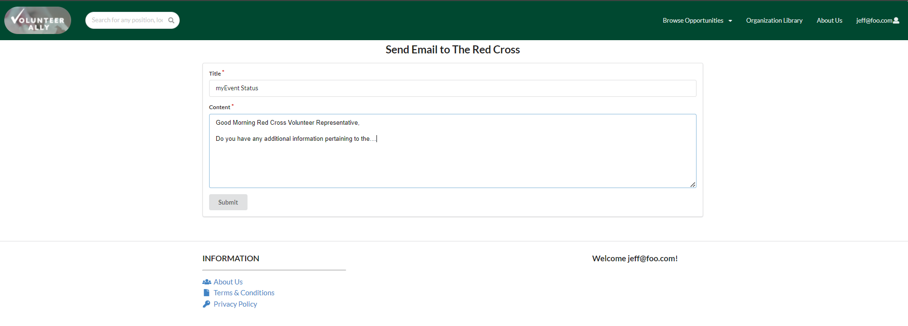
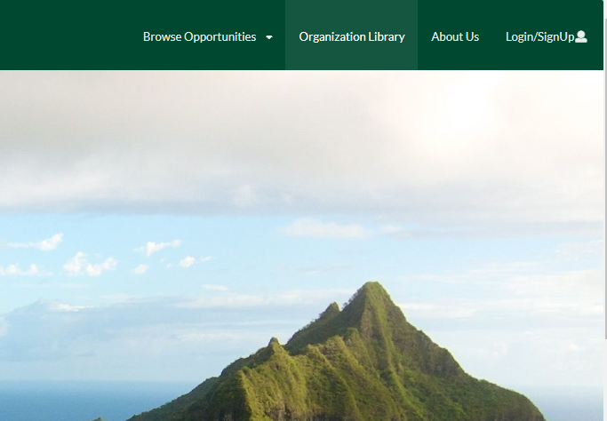

---
title: UH Manoa Meteorites
---  

* [Uh Manoa Meteorites Organization](https://github.com/uh-manoa-meteorites)

## Table of contents
* [Overview](#overview)
* [User Guide](#user-guide)
    * [Login Page](#login-page)
    * [SignUp Page](#signupregister-page)
    * [Volunteer Profile Page](#volunteer-profile-page)
        * [Edit Volunteer Profile Page](#edit-volunteer-profile-page)
    * [The Search Bar](#search-bar-functionality)
    * [Browsing Opportunities](#browsing-opportunities)
        * [Browsing All Opportunities](#browse-all-opportunities)
        * [Filter Opportunities](#find-a-specific-opportunity)
    * [Adding an Opportunity to the Volunteer Profile](#adding-an-opportunity-to-the-volunteer-profile)
    * [Sharing an Opportunity to Social Media](#)
    * [Opportunity Profile Page](#opportunity-profile-page)
        * [Send Email Button](#email-organization)
        * [Send Direct Message Button](#send-direct-message)
        * [Get Directions Button](#get-directions)
    *[Organization Profile Page](#organization-profile-page) 
    *[About Us Page](#about-us-page) 
* [Milestones](#milestones)
* [Community Feedback](#community-feedback)
* [Developer Guide](#developer-guide)
* [Deployment](#deployment)
* [Team Members](#team-members)

## Overview

We are aiming to create an application that better links volunteers with organizations. This app will better display relevant information with regards to volunteer work specifically and put volunteers in touch with the right people, rather than navigating complicated organization websites. We also plan to be able to filter a map of the island in order to better display more convenient opportunities for users. 

## User Guide

This is a user guide for Volunteer Ally.

### Landing Page

When arriving at the landing page, the user has the option to login to an existing account or create a new one. It also displays general information about the app in case the user is contemplating creating an account.

### Login Page

To log into a pre-existing account, or to create an account, click the LogIn/SignUp button at the top right corner.

Login to an account here, or click register to sign up!


### Signup/Register Page

To create an account, enter the following information and be sure to be older than 16 years of age!  

  

Continue by filling out the information, anything marked with a red asterisk is required. Choose special interests, upload a profile picture, and pick special skills to be displayed on a profile page.  

  

Make sure to agree to the terms and conditions and select any availability or environmental preference of note.  

  

Finally click Sign Up to finalize an account  

  

Log in with the new credentials [Login Page](#login-page) and the default profile page can now be viewed by the My Profile button on the top right corner  

### Volunteer Profile Page  
  
Logging in will route the user to their profile page, but at any point the profile page may be viewed via the My Profile button in the top corner of the page on the navigation bar. 

   
  
A basic volunteer profile looks similar to this:  

  
  
Opportunities the volunteer is interested in are displayed as well as the total number of hours volunteered and other useful information. The bottom portion of the profile page shows other special interests.

  

#### Edit Volunteer Profile Page  

To edit or update any information on the profile page or to change a picture, click on the Edit Profile button  

  
  
The Edit Profile Page will now be displayed, if no changes are made or the submit button is never clicked the profile will remain unchanged. Edit any information or change the picture.

  
  
Update any new abilities or change in environmental preference  

 

When the changes are completed, click Submit and this message will display confirming changes were successful  

  
  
All changes are now reflected on the volunteer profile page
  
### The Search Bar  
  
At any point, the search bar can be used regardless of login status, the search bar is displayed on the top left of the page on the navigation bar

  
  
Opportunities can be searched by both Title and Organization

  
  
Click on any card display further information or even add the opportunity to the list and share to social media (must be logged in to add/share the opportunity).  
  
### Browsing Opportunities
  
There are two different ways to look for new opportunities to volunteer for. 

#### Browse All Opportunities 

To view all upcoming opportunities, simply click the browse opportunities tab button to display the browse all option  


Then click Browse Opportunities to view this page  

  
  
From here all upcoming opportunities from all organizations can be viewed added, or shared (must be logged in to add or share)  
  
#### Find a Specific Opportunity

Opportunities can be search by interest, special abilities, organization name or environmental preference by clicking the Filter Opportunities button on the top right of the page on the navigation bar

  
  
Clicking the button will display the filter opportunities page  

 

Click any of the tabs on the left hand side to search specific opportunities by the desired category, for example, a volunteer may be interested in opportunities involving environment, education or both  

  
  
In this case, only opportunities involving both environment and education are displayed when clicking the Submit button  

  
  
Removing the education interest by unchecking the box and clicking submit will display only opportunities relating to environment  

    
  
At any point an opportunity can be added or shared  
  
### Adding an Opportunity to the Volunteer Profile  
  
Opportunities can be added to the volunteer profile at any time, this allows the volunteer to keep track of upcoming opportunities and serve as a way to claim hours if the opportunity was attended (opportunities can only be added if a volunteer is logged in however all relevant opportunity information can be viewed by anyone as to promote views of an opportunity). For example, Jeff only plans on attending or is interesting in attending only one opportunity  

 

Adding opportunities can be done from any page, in this case the opportunity is added from the [landing page](#landing-page)  

  
  
Adding the Back 2 School opportunity by clicking the Add Event button will display a success message  

    
  
Now the opportunity is tracked on the volunteer's profile like for Jeff  


  
Jeff can now click on an opportunity to see and communicate information about it by clicking a card (this can be done from anywhere there is an opportunity card) and displaying the [opportunity profile page](#opportunity-profile-page)  
  
### Sharing an Opportunity to Social Media  
  
While logged in, a volunteer may share an opportunity to Facebook, Twitter, Email or Pinterest by clicking on the associated icon on an opportunity card

  
  
Clicking on the twitter icon, for example, will open a pop-up window prompting logging in to the twitter (facebook/pinterest/email) before sharing the opportunity on the associated social media page  

  
  
Or sharing to facebook  

   
  
A link to the  [opportunity profile page](#opportunity-profile-page) will be seen on the associated social media page

 

Once again, click the link to see further information regarding the opportunity

### Opportunity Profile Page  
  
The opportunity profile page displays relevant information deemed necessary by an organization administrator that [creates the opportunity](#create-opportunity) creates opportunities on behalf of the organization. The opportunity profile has a customizable banner (only when logged in as an organization), a [directions button](#get-directions), a [direct messaging button](#send-direct-message), and a [send email button](#send-an-email)

  
  
More relevant information along with an organization specific photo gallery component  

  
  
Lastly, the relevant interest, desired special skills and environmental atmosphere

   
  
The opportunity profile page can be modified by a logged in organization representative

#### Send an Email  
  
To send an email from the opportunity profile page, simply click send email located towards the top  

  
  
Clicking the button displays the email page  

  
    
Clicking Submit will send the email queueing a pop up window to notify the volunteer it was delivered to the associated volunteer representative for the organization holding the opportunity  

  
  
The volunteer may now continue navigation  
  
#### Send Direct Message  
  
Sending a direct message is similar to sending an email but the volunteer representive will read the message on the application [inbox page](#direct-message-inbox) instead of their email account. To send a "DM" simply click the Direct Message button

  
  
Clicking the Direct Message button will display a direct message pop up box  

  
  
Clicking send will display a message that the message sent, if successful  
  
  
The message can no be seen in the [direct message inbox](#direct-message-inbox) page of the associated organization to view upon their next login  
  
#### Get Directions  
  
Clicking the Get Direction button on the event profile will pop up a map window allowing for location view and directions to the opportunity address via google maps  

  
  
Clicking the Get Directions button will display this pop up window  

  
  
This particular opportunity has an address of 222 Banana Rd. Florida
  
### Organization Profile Page  
  
The organization profile is similar to the volunteer profile except for that it is visible to not only registered volunteers but general application traffic as well. The organization profile can be reached by using the organization library. First click the organization library button on the navigation bar  

   
  
Then any organization can be clicked from this point to display all the relevant organization and opportunities they have  

  
  
Clicking on the Red Cross opens there profile page  

  
  
And some of the upcoming events  

  
  
The organization profile can be expanded and the email/dm option can easily be moved to the organization profile as well  
  
### About Us Page  
 
The about us page is information pertaining to the founders of Volunteer Ally and information on their goals  

  
  
Simple, yet refined...  
  


### Admin Home Page

Hold the ability to include admin functionality.


### Browse Organizations

A page where the organizations will be listed equally as not to make one look better than the other

### Home page

Possibly the users home page where they might update any of their information.

#### Add Opportunity

A page that will hold the ability to add an opportunity to a google calender or something similar

### Share on Social Media

A page that will enable the user to share an opportunity to linked social media accounts.

### Notice for Logging Hours

We want to be able to have a verification system for those that need to keep track of how many hours of service they do. This would be a toggle via email to the organizations volunteer manager.

### Badge System

Render profile badges to reflect certain amount of volunteer hours put in.

## Milestones

* [M1 Project Board](https://github.com/uh-manoa-meteorites/nonprofit-project-template/projects/1)
* [M2 Project Board](https://github.com/uh-manoa-meteorites/nonprofit-project-template/projects/3)
* [M3 Project Board](https://github.com/uh-manoa-meteorites/nonprofit-project-template/projects/4)
* [M4 Project Board](https://github.com/uh-manoa-meteorites/nonprofit-project-template/projects/6)
* [M5 Project Board](https://github.com/uh-manoa-meteorites/nonprofit-project-template/projects/7)
* [M6 Project Board](https://github.com/uh-manoa-meteorites/nonprofit-project-template/projects/8)

## Community Feedback


## Developer Guide

### Installation

First, [install Meteor](https://www.meteor.com/install).

Second, install package...

Then, cd into the app/ directory of your local copy of the repo, and install the required libraries with:

```
$ meteor npm install
```

## Development History


## Running the system

Once the libraries are installed, you can run the application by invoking the "start" script in the [package.json file]:

```
$ meteor npm run start
```

The first time you run the app, it will create default users and contacts.

Here is the output:

```
meteor npm run start

> meteor-application-template-react@ start /Users/triciamariereyes/Documents/GitHub/kanak-attack-manoa/app
> meteor --no-release-check --exclude-archs web.browser.legacy,web.cordova --settings ../config/settings.development.json

[[[[[ ~/Documents/GitHub/kanak-attack-manoa/app ]]]]]

=> Started proxy.                             
=> Started MongoDB.                           
data to be populated....
=> Started your app.

=> App running at: http://localhost:3000/
```


### Note regarding "bcrypt warning":

You might also get the following message when you run this application:

```
Note: you are using a pure-JavaScript implementation of bcrypt.
While this implementation will work correctly, it is known to be
approximately three times slower than the native implementation.
In order to use the native implementation instead, run

  meteor npm install --save bcrypt

in the root directory of your application.
```

On some operating systems (particularly Windows), installing bcrypt is much more difficult than implied by the above message. Bcrypt is only used in Meteor for password checking, so the performance implications are negligible until your site has very high traffic. You can safely ignore this warning without any problems during initial stages of development.

### Viewing the running app

If all goes well, the template application will appear at 

### ESLint

You can verify that the code obeys our coding standards by running ESLint over the code in the imports/ directory with:

```
meteor npm run lint
```

## Deployment
A link to our deployed application on Digital Ocean 

## Team Members
* Nicholas Carr
    * [Portfolio](https://nicholasbcarr.github.io/)
* Justin Loi
    * [Portfolio](https://justin-loi.github.io/)
* Su Lao
    * [Portfolio](https://sulao1999.github.io/)
* Irene Ma
    * [Portfolio](https://irene-ma.github.io/)
* Gerald Lee
    * [Portfolio](https://glee25.github.io/)
* Tri Pham
    * [Portfolio](https://tricpham.github.io/)
* Tracy Bui
    * [Portfolio](https://tbui00.github.io/)

